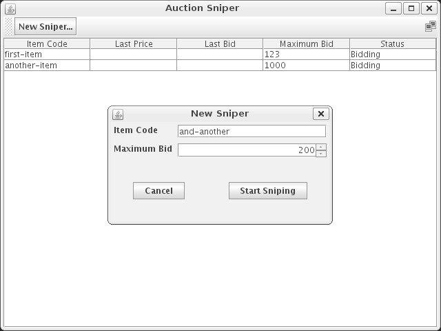

# 09 Commissioning an Auction Sniper

We want to show how the techniques fit together over a larger scale than the example usually presented in books.
Another goal was to tell a realistic story.
Finally, we wanted to emphasize our culture of very incremental development.
By keeping the system always clean and always working, we can focus on just the immediate change at hand, and merging changes back in is never a crisis.

## To begin at the beginning

Auction Sniper is an application that watches online auctions and automatically bids slightly higher whenever the price changes, until it reaches a stop-price or the auction closes.

We start by talking through their ideas with the buyers group and find that we need to agree on some basic terms:

- *Item* is something that can be identified
- *Bidder* is a pearson or organization that is interested in buying an item
- *Bid* is a statement that a bidder will pay a given price for an item
- *Current price* is the current highest bid for the item
- *Stop price* is the most a bidder is prepared to pay
- *Auction* is a process for managing bids
- *Auction house* is an institution that hosts auctions

The discussion generate a long list of requirements.
We talk through the options and the buyers reluctantly agree that they'd rather get a basic application working first. Once that's in place, we can make it more powerful.

We decide to build the Auction Sniper as a Java Swing application.
It will run on a desktop and allow the user to bid for multiple items at a time.
It will show:

- the identifier
- stop price
- current auction price
- current status

for each item it's sniping.

Buyers will be able to add new items for sniping through the user interface, and the display values will change in response to events arriving from the auction house.



We also talk to the technicians at Southabee 's who support their online services.
They send us a document that describes their protocol for bidding in auctions, which uses eXtensible Messagging and Presence Protocol **XMPP (Jabber)** for its underlying communication layer.

>XMPP is a protocol for streaming XML elements across the network.
It has decentralized, client/server architecture. There is no central server.
Every user on the network has a unique Jabber ID (JID).

## Communicating with an auction

### The auction protocol

The protocol is simple:

- bidders send **commands**:
  - Join
  A bidder joins an auction.
  - Bid
  A bidder sends a bidding price to the auction.
- auctions send **events**:
  - Price
  An auction reports the currently accepted price.
  This event also includes the minimum increment that the next bid must be raised by, and the name of bidder.
  The auction will send this event to a bidder when it joins and to all bidders whenever a new bid has been accepted.
  - Close
  An auction announces that it has closed.
  The winner of the last price event has won the auction.

A Sniper joins an auction, then there are some rounds of bidding, until the auction closes, at which point the Sniper will have won or lost.

### The XMPP Messages

Southabee 's On-Line XMPP Messages are pretty simple, they only involve a few names and values, and are serialized in a single line with key/value pairs.
Each line starts with a version number for the protocol itself.

```bash
SOLVersion: 1.1; Command: JOIN;
SOLVersion: 1.1; Event: PRICE; CurrentPrice: 192; Increment: 7; Bidder: Someone else;
SOLVersion: 1.1; Command: BID; Price: 199;
SOLVersion: 1.1; Event: CLOSE;
```

## Getting there safely

Even a small application like this is too large to write in one go.

A critical technique with incremental development is learning how to slice up the functionality so that it can be built a little at a time.

Each slice should be:

- significant and concrete enough that the team can tell when it's done
- small enough to be focused on one concept and achievable quickly

Our immediate task is to figure out a series of incremental development steps for the application.
The first is absolutely the smallest feature we can build, the **walking skeleton**.

After some discussion, we come up with this sequence of features to build:

- single item: join, lose without bidding
- single item: join, bid, and lose
- single item: join, bid, and win
- show price details
- multiple items
Support bidding for multiple items
- add items through the user interface
- stop bidding at the stop price

>To Do List on an index card

## This isn't real

- this isn't realistic architecture
XMPP is neither reliable nor secure, and so unsuitable for transactions.
- this isn't Agile Planning
In a real project, we'd likely have a view of the whole deliverable (a release plan) before jumping in.
- this isn't realistic usability design
Good user experience design investigates what the end user is really trying to achieve and uses that to create a consistent experience.
