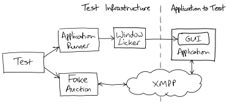

# 10 The Walking Skeleton

## Get the skeleton out of the closet

The point of the skeleton is to help us understand the requirements well enough to propose *and validate* a broad-brush system structure.

For most projects, developing the walking skeleton takes a surprising amount of effort because:

- deciding what to do will flush out all sorts of questions about the application and its place in the world
- the automation of building, packaging, and deploying into a production-like environment will flush out all sorts of technical and organizational questions.

>**Iteration Zero**
In most Agile projects, there's a first stage where the team setting up its physical and technical environments.
A common practice is to call this step iteration (the team still needs to time-box its activities) zero (it's before functional development starts in iteration one).
One important task for iteration zero is to use the walking skeleton to test-drive the initial architecture.

## Our very first test

The thinnest slice we can imagine testing, the first item on our to-do list, is that the Auction Sniper can join an auction and then wait for it to close.

We like to start by writing a test as if its implementation already exists.
First we code up a test to describe our intentions as clearly as we can.
Then we build the infrastructure to support the way we want to test the system.
This usually takes a large part of our initial effort.

With this infrastructure in place, we can implement the feature and make the test pass.

Outline of the test we want:

1. when an auction is selling an item
2. and an Auction Sniper has started to bid in that auction
3. then the auction will receive a Join request from the Auction Sniper
4. when an auction announces that it is Closed
5. the the Auction Sniper will show that it lost the auction

We need to translate this into something executable.
We also need mechanisms to control the application and the auction that the application is talking to.

We'll need a fake auction service that we can control from our tests to behave like the real thing.
This fake auction, or stub, will be as simple as we can make it.

Controlling the Sniper application is more complicated.
We want our skeleton test to exercise our application as close to end-to-end as possible.
We also want our test to be clear about what is being checked.

```java
public class AuctionSniperEndToEndTest {
    private final FakeAuctionServer auction = new FakeAuctionServer("item-54321");
    private final ApplicationRunner application = new ApplicationRunner();

    @Test
    public void sniperJoinsAuctionUntilAuctionCloses() throws Exception {
        auction.startSellingItem();                 // step 1
        application.startBiddingIn(auction);        // step 2
        auction.hasReceivedJoinRequestFromSniper(); // step 3
        auction.announceClosed();                   // step 4
        application.showsSniperHasLostAuction();    // step 5
    }

    // additional cleanup
    @After
    public void stopAuction() {
        auction.stop();
    }

    @After
    public void stopApplication() {
        application.stop();
    }
}
```

We've adopted certain naming conventions for the methods of the helper objects.
In writing the test, one of the assumptions we've made is that a FakeAuctionServer is tied to a given item.

### One domain at a time

Keeping the language consistent helps us understand what's significant in this test, with a nice side effect of protecting us when the implementation inevitably changes.

## Some initial choices

Now we have to make the test pass, which will require a lot of preparation.
We need to find or write four components:

1. an XMPP message broker
2. a stub auction that can communicate over XMPP
3. a GUI testing framework
4. a test harness that can cope with our multi-threaded, asynchronous architecture.

We also have to get the project under version control with an automated build/deploy/test process.
Compared to unit-testing a single class, there is a lot to do, but it's essential.

Working through our first end-to-end test will force some of the structural decisions we need to make, such as packaging and deployment.



### End-to-end testing

End-to-end testing for event-based systems has to cope with a-synchrony.
The tests run in parallel with the application and do not know precisely when the application is or isn't ready.

The usual technique is to poll for the effect and fail if it doesn't happen within a given time limit.

All this makes end-to-end testing slower and more brittle, so failures might need interpretation.

### Ready to start

This first test is not really end-to-end.
It doesn't include the real auction service because that is not easily available.
In this case, we have to start with a fake auction service based on the documentation from Southabee 's On-Line.
